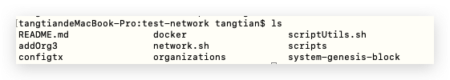

# 使用Fabric的测试网络(2.2.0)

## 安装步骤（官网）

在运行测试网络之前，您需要克隆`fabric-samples`代码库并下载Fabric镜像。确保已安装 的 [准备阶段](https://hyperledger-fabric.readthedocs.io/zh_CN/release-2.2/prereqs.html) 和 [安装示例、二进制和 Docker 镜像](https://hyperledger-fabric.readthedocs.io/zh_CN/release-2.2/install.html).

1. 如果需要，请克隆 [hyperledger/fabric-samples](https://github.com/hyperledger/fabric-samples) 仓库

2. 检出适当的版本标签

3. 将指定版本的 Hyperledger Fabric 平台特定二进制文件和配置文件安装到 fabric-samples 下的 /bin 和 /config 目录中

4. 下载指定版本的 Hyperledger Fabric docker 镜像

   

## 安装步骤（详细）

由于网络的原因官网提供的搭建测试网络脚本在下载二进制文件的时候会很慢在。这里按照官网的思路手动下载二进制文件

### 下载源码包和二进制文件

1.进入github fabirc 官网，找到v2.2.0的taghttps://github.com/hyperledger/fabric/releases/tag/v2.2.0

2.页面最下面，有编译好的二进制文件与源码，下载相应操作系统的二进制文件与源码包


### 运用源码包的bootstrap.sh安装fabric-sample与镜像文件

1. 解压fabric-2.2.0.tar.gz文件，该文件为fabric的源码包，我们只提取它里面的bootstrap.sh文件

   进入解压文件夹路径./fabric-2.2.0/scripts。找到`bootstrap.sh`待用

2. 新建一个文件夹fabricNetwork（文件位置和名称自定义），拷贝`bootstrap.sh`到当前文件夹。

3. 分析`bootstrap.sh`

   ```shell
   #当前版本2.2.0
   VERSION=2.2.0
   #ca的版本，注意后面需要下载此版本的二进制文件到指定文件夹。后面会讲
   CA_VERSION=1.4.7
   
   #......
   #此脚步做三件事情
   
   #第一件事情需要拉取fabric-samples,就是官方提供搭建网络和演示的一些例子。
   if [ "$SAMPLES" == "true" ]; then
       echo
       echo "Clone hyperledger/fabric-samples repo"
       echo
       cloneSamplesRepo
   fi
   #第二件事情需要拉取二进制文件。
   if [ "$BINARIES" == "true" ]; then
       echo
       echo "Pull Hyperledger Fabric binaries"
       echo
       pullBinaries
   fi
   #拉取所需要的镜像
   if [ "$DOCKER" == "true" ]; then
       echo
       echo "Pull Hyperledger Fabric docker images"
       echo
       pullDockerImages
   fi
   ```

4. 修改`bootstrap.sh`

   因为二进制文件已经下载。修改BINARIES=false。并且保存
   
   ```sh
   #找到
   DOCKER=true
   SAMPLES=true
BINARIES=true
   ```
   
   ```sh
   #修改为,BINARIES=false
   DOCKER=true
   SAMPLES=true
   BINARIES=false
   ```
   
5. 启动`bootstrap.sh`

6. `bootstrap.sh`执行完毕

   fabric-samples工程在fabricNetwork文件里。

   

   有如下镜像。

   

   

### 二进制文件和配置文件安装到 fabric-samples 下的 /bin 和 /config 目录中

1. 解压hyperledger-fabric-darwin-amd64-2.2.0.tar.gz

   

2. 拷贝 /bin 和 /config 目录到fabric-samples文件夹下


### 安装 fabric-ca二进制文件

1. 在bootstrap.sh文件可知道。CA_VERSION=1.4.7

2. 进入https://github.com/hyperledger/fabric-ca/releases/tag/v1.4.7，页面最下面下载相应平台的二进制文件。

   

3. 解压文件得到文件目录bin。拷贝bin中的fabric-ca-client、fabric-ca-server文件到fabric-samples文件中的bin目录。

### 启动测试网络

进入fabric-samples文件夹

`ls`


进入测试网络文件夹

`cd test-network/`


启动网络

`./network.sh up`

